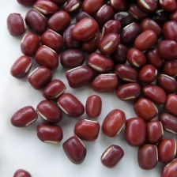
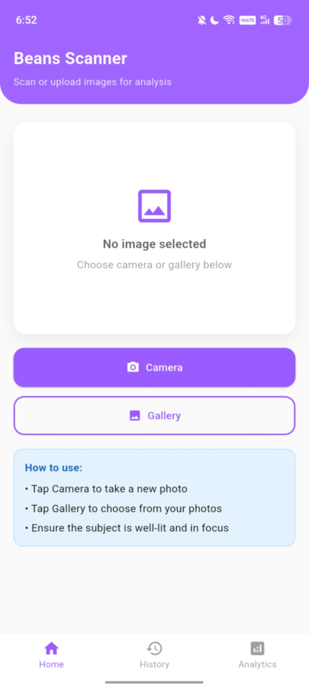
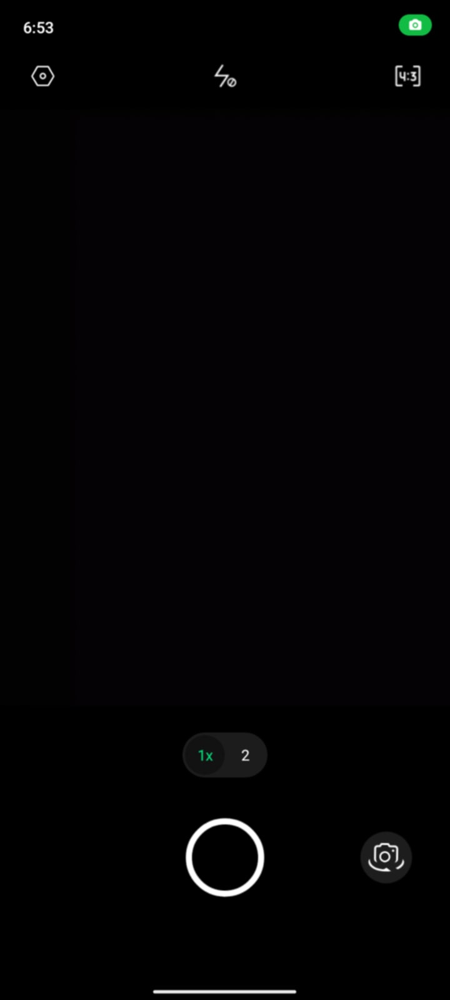
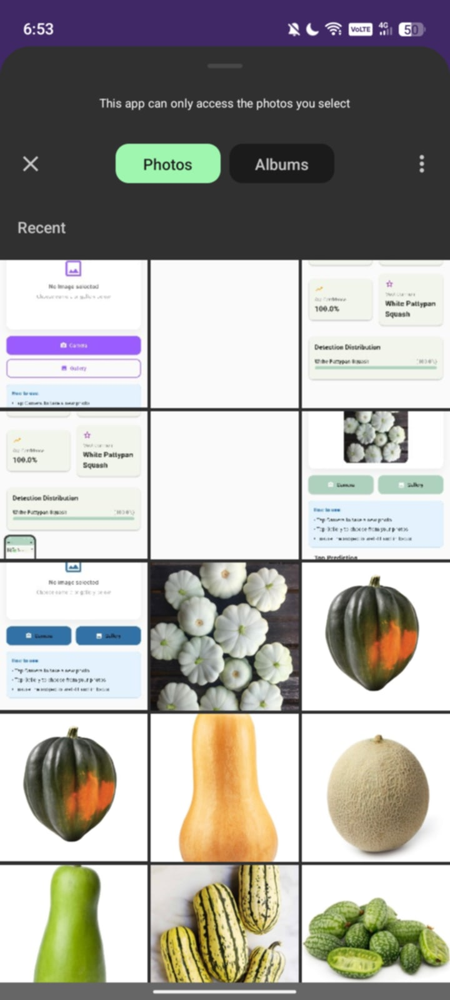
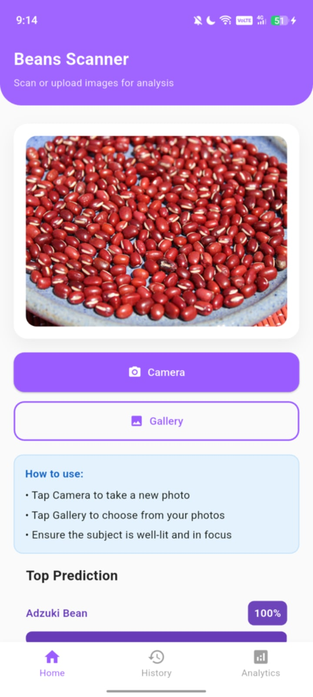
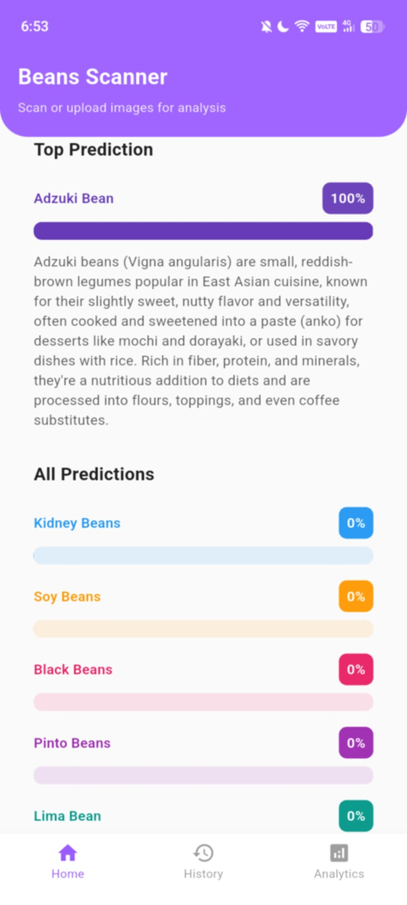
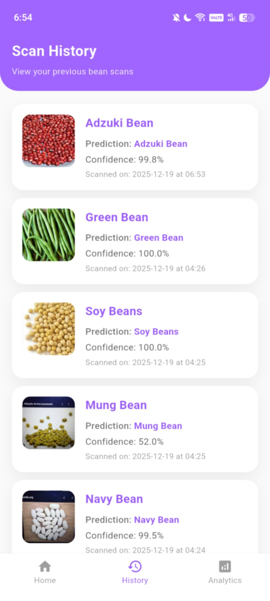
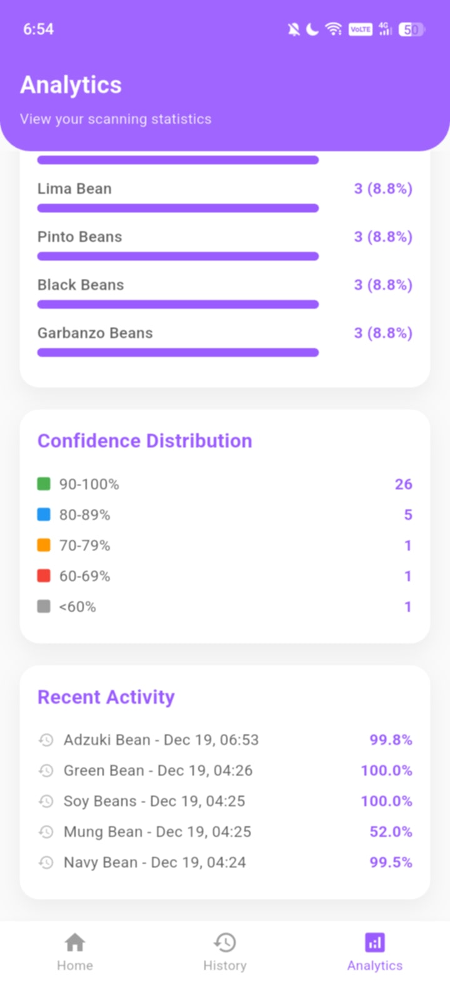

## 👋 Hello there, I am Mickmick!

✨ Information Technology Student | Exploring web & building cool stuff  
📍 Studying at Caraga State University Cabadbaran Campus

---

### 💻 About Me

I'm passionate about coding, open source, and learning new technologies.

- 🎓 Currently working on: Web Development and Mobile Application
- 🌱 Learning: Mobile Development  
- 🏐 I love playing volleyball  
- 🎧 Music helps me stay productive  

---

## 🛠️ Tech Stack

### 🌐 Web Development


### 🧠 Programming Languages


### 📱 Mobile Development


### ⚙️ Tools & Environment


---

## 📈 GitHub Stats


---

## 📌 Featured Project: Beans Scan (Flutter App)

### 📖 About This Repository
Your GitHub profile is your overall account where all of your projects are stored. Inside your GitHub profile, you can create different repositories for different projects.

This repository represents **one specific project** inside my GitHub account and serves as the **final project** for my Information Technology coursework.

The **README.md** file explains what the project is about, how it is organized, and what features the application provides.  
Inside this project, you will find folders for codes, screenshots, models, and class samples. This structure reflects how GitHub repositories are typically designed.

---

## 🌱 Current Project: Beans Scan

**Beans Scan** is a mobile application developed using **Flutter**.  
It is a simple **beans image classification app** that helps users identify different types of beans using a trained image recognition model.

The app allows users to:
- 📷 Take a photo using the camera
- 🖼 Upload an existing image from the gallery

After scanning, the app displays:
- The predicted bean class
- Confidence percentages
- Analytics such as detections per class
- A history of previous scans

This project allowed me to practice Flutter UI design, basic machine learning integration, and organizing app features into a clean and user-friendly interface.

---
## 🫘 Beans Classes Overview

Below is an overview of the **Beans classes** that Beans Scan can recognize.  
Each class includes a short description and a sample image from the `Beans_class` folder.

<table>
<tr>
<td align="center">
<br>
<b>Adzuki Beans</b><br>
Small red beans commonly used in Asian desserts and sweet dishes.
</td>

<td align="center">
<br>
<b>Black Beans</b><br>
Dark-colored beans rich in protein and fiber, often used in soups and stews.
</td>
</tr>

<tr>
<td align="center">
<br>
<b>Garbanzo Beans</b><br>
Also known as chickpeas, widely used in hummus and Mediterranean dishes.
</td>

<td align="center">
<br>
<b>Green Beans</b><br>
Fresh and crunchy beans commonly used as vegetables in meals.
</td>
</tr>

<tr>
<td align="center">
<br>
<b>Kidney Beans</b><br>
Red kidney-shaped beans often used in chili and rice dishes.
</td>

<td align="center">
<br>
<b>Lima Beans</b><br>
Flat and pale beans known for their creamy texture.
</td>
</tr>

<tr>
<td align="center">
<br>
<b>Mung Beans</b><br>
Small green beans commonly used in Asian cuisine and desserts.
</td>

<td align="center">
<br>
<b>Navy Beans</b><br>
Small white beans often used in baked beans and soups.
</td>
</tr>

<tr>
<td align="center">
<br>
<b>Pinto Beans</b><br>
Spotted beans commonly used in Mexican and Latin American dishes.
</td>

<td align="center">
<br>
<b>Soy Beans</b><br>
Beans widely used for tofu, soy milk, and other soy products.
</td>
</tr>
</table>

## 📱 Application Screenshots

### Main Page
<p align="center">

</p>

**The Main Page** is the starting point of the app. From here, users can navigate to the dictionary, open the camera or upload screen, and access other features of Beans Scan.

---

### Other Screens

<table>
<tr>
<td align="center">
<br>
<b>Camera Screen</b>
</td>

<td align="center">
<br>
<b>Gallery Upload</b>
</td>

</tr>
<td align="center">
<br>
<b>Scan Result</b>
</td>


<td align="center">
<br>
<b>Scan Result</b>
</td>
</tr>

<tr>
<td align="center">
<br>
<b>History Page</b>
</td>

<tr>
<td align="center">
<br>
<b>Analytics Page 1</b>
</td>

<td align="center">
<br>
<b>Analytics Page 2</b>
</td>
</tr>
</table>


## 🛠 Project Structure

```text
Beans_class/            → Sample images of beans classes
Beans_scanner(codes)/   → Application source codes
beans_model/            → TFLite model and label files
apps_screenshot/        → App screenshots
README.md               → Project documentation

